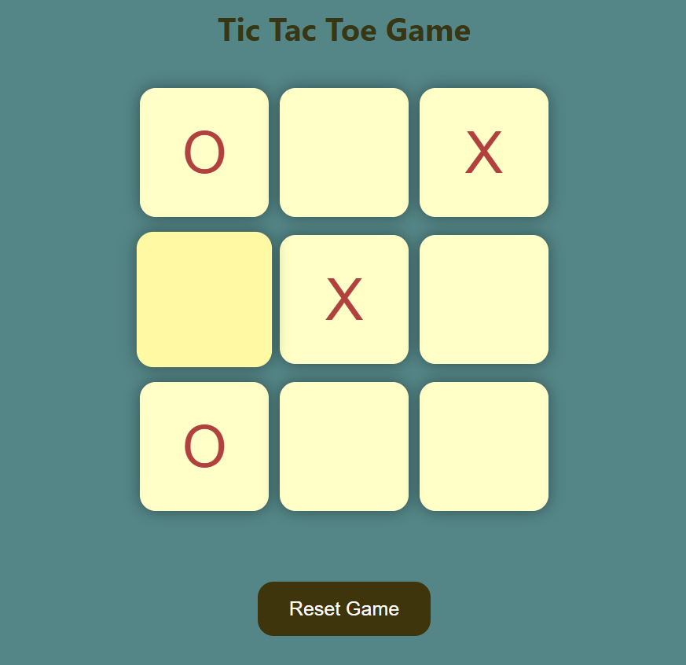
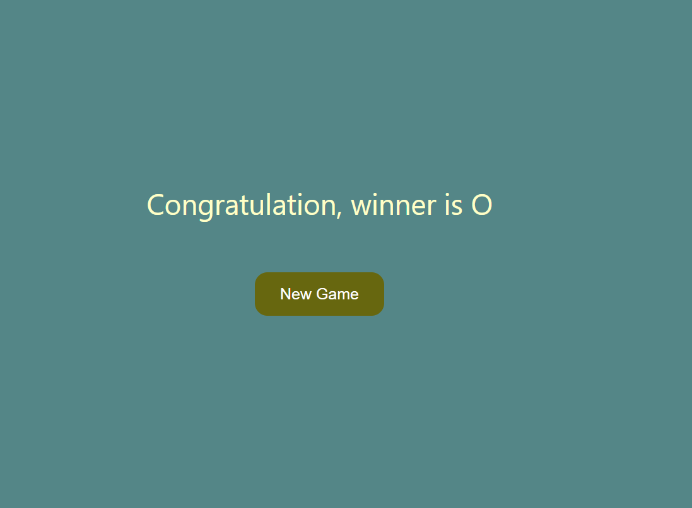

# 🎮 Tic Tac Toe Game

<div align="center">

### A Modern and Interactive Tic Tac Toe Experience Built with HTML, CSS & JavaScript


A responsive browser-based Tic Tac Toe game featuring dynamic gameplay, winner detection, smooth animations, and a clean user interface.

</div>

---

## 🚀 Features

✨ Interactive two-player gameplay

🏆 Automatic winner detection

🔄 New Game functionality

♻️ Reset Game support

🎨 Modern and responsive user interface

📱 Mobile-friendly design

⚡ Real-time game updates using JavaScript

🖱️ Smooth hover animations and transitions

♿ Basic accessibility support

🚫 Prevents players from selecting occupied cells

---

## 📸 Screenshots

<div align="center">




</div>

> Replace `game-home.png` and `winner-screen.png` with your actual screenshot filenames if they are different.

---

## 🎯 How to Play

1. Open the game in your browser.
2. Player **O** makes the first move.
3. Players alternate turns placing their marks on the board.
4. Once selected, a cell cannot be changed.
5. The game automatically checks for winning combinations.
6. The first player to align three symbols wins.
7. Click **New Game** or **Reset Game** to play again.

---

## 🛠️ Tech Stack

| Technology       | Purpose                      |
| ---------------- | ---------------------------- |
| HTML5            | Structure and Layout         |
| CSS3             | Styling and Responsiveness   |
| JavaScript (ES6) | Game Logic and Interactivity |

---

## 🧠 Core Concepts Implemented

* DOM Manipulation
* Event Handling
* JavaScript Functions
* Arrays and Loops
* Conditional Statements
* State Management
* Responsive Design
* CSS Animations
* Accessibility Practices

---

## ⚙️ Game Logic Overview

The game uses predefined winning combinations to determine the winner.

### Winning Patterns

```javascript
const winPatterns = [
    [0, 1, 2],
    [0, 3, 6],
    [0, 4, 8],
    [1, 4, 7],
    [2, 5, 8],
    [2, 4, 6],
    [3, 4, 5],
    [6, 7, 8]
];
```

### Workflow

* Player clicks a box.
* Current player's symbol is displayed.
* Selected box becomes disabled.
* The application checks all winning patterns.
* If a winner exists:

  * Winner message is displayed.
  * Board is disabled.
* Users can restart the game anytime.

---

## 📂 Project Structure

```text
tic-tac-toe-game/
│
├── screenshots/
│   ├── game-home.png
│   └── winner-screen.png
│
├── index.html
├── style.css
├── app.js
└── README.md
```

---

## 🚀 Getting Started

### Clone the Repository

```bash
git clone https://github.com/amittdas/tic-tac-toe-game.git
```

### Navigate to the Project Directory

```bash
cd tic-tac-toe-game
```

### Run the Project

Simply open:

```text
index.html
```

in your preferred browser.

---

## 🎨 UI Highlights

* Responsive game board using `vmin` units
* Smooth button hover effects
* Animated winner announcement
* Clean color palette
* Shadow effects for enhanced visual appeal
* User-friendly controls

---

## 🔮 Future Enhancements

* 🤖 AI Opponent
* 🤝 Online Multiplayer
* 📊 Score Tracking
* 🎵 Sound Effects
* 🌙 Dark Mode
* 🤝 Draw/Tie Detection
* 🏅 Match Statistics
* ⏱️ Timer-Based Gameplay

---

## 👨‍💻 Author

### Amit Das

Final Year B.Tech (Information Technology)

**Skills**

* HTML
* CSS
* JavaScript
* TypeScript
* MERN Stack
* C++
* Python

### Connect With Me

GitHub: https://github.com/amittdas

---

<div align="center">

### ⭐ If you enjoyed this project, consider giving it a star!

**Happy Coding 🚀**

</div>
